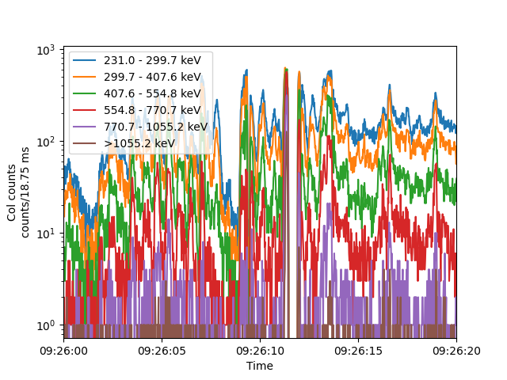

# microburst_dispersion
Calculate the time of flight dispersion of electron microburst precipitation observed by the FIREBIRD-II CubeSats.

# Installation
1. Get a local copy of this code. The best way is via GitHub:
   ```bash
    git clone git@github.com:mshumko/microburst_dispersion.git
    cd microburst_dispersion
   ```
2. Install this package in a virtual environment or system wide (virtual environment recommended) via these two ways: 
   ```bash 
   python3 -m pip install .
   ```
   or
   ```bash 
   python3 -m pip install -r requirements.txt 
   ```

3. (optional) Configure the FIREBIRD-II data directory.
   ```bash 
   python3 -m microburst_dispersion init
   ```
   and answer the prompt.

# User Guide
## Download, load, and plot FIREBIRD-II HiRes data
This code provides a FIREBIRD-II HiRes data downloader and loader. If `microburst_dispersion` doesn't find a HiRes file in `microburst_dispersion.config["fb_data_dir"]` (or its subdirectory), it will attempt to download it from the [Data Archive](http://solar.physics.montana.edu/FIREBIRD_II/).

### Example 1
Load (and download, if necessary) the FIREBIRD-II data.
```python
import matplotlib.pyplot as plt

import microburst_dispersion.firebird

hr = microburst_dispersion.firebird.Hires(3, '2015-02-02').load()  
print(hr.keys())
print(hr.attrs.keys()) 
```

should print the data keys

```python
dict_keys(['Time', 'Alt', 'Col_counts', 'Col_flux', 'Count_Time_Correction', 'Flag', 'Lat', 'Lon', 'Loss_cone_type', 'MLT', 'McIlwainL', 'Sur_counts', 'Sur_flux', 'kp'])
```
and attributes for the data keys
```python
dict_keys(['Alt', 'CADENCE', 'CAMPAIGN', 'Col_counts', 'Col_flux', 'Count_Time_Correction', 'DESCRIPTION', 'Flag', 'Lat', 'Lon', 'Loss_cone_type', 'MISSION', 'MLT', 'McIlwainL', 'SPACECRAFT', 'Sur_counts', 'Sur_flux', 'Time', 'kp'])
```
.

### Example 2
Plot the HiRes Collimated detector data when microbursts where observed.



```python
import matplotlib.pyplot as plt
from datetime import datetime

import microburst_dispersion.firebird

fb_id = 3
date = '2015-02-02'  # can also be a datetime or pd.Timestamp object
hr = microburst_dispersion.firebird.Hires(fb_id, date).load()

for ch, ch_label in enumerate(hr.attrs['Col_counts']['ENERGY_RANGES']): 
    plt.plot(hr['Time'], hr['Col_counts'][:, ch], label=ch_label)

plt.legend()
plt.xlabel('Time')
plt.ylabel(f'Col counts\ncounts/{1000*hr.attrs["CADENCE"]} ms')
plt.title(f'FU{fb_id} | {date}')
plt.yscale('log')
plt.xlim((datetime(2015, 2, 2, 9, 26), datetime(2015, 2, 2, 9, 26, 20)))
plt.show()
```